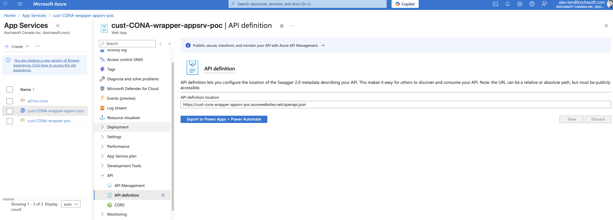

## App Service for Logic Apps to AI Foundry integration

This src dir is designed to be deployed into Azure App Service and allow it to be integrated with Logic Apps. 
The functionality of this src is receive payload (JSON format) and enrich the context, then send to the AI Foundry Agent, 
get response, process the response, return the response to Logic Apps. 

Because this app can have as much functionality as a regular app, it is much more flexible in terms of what we can do with 
the context before and after involking AI agents, we can also incoporate MCP Client to allow LLM to integrate with other tools
beyong MS Azure eco system. 

## Prerequisite
The bare minimal working solution reside in the src/api directory. 
It is the core functionality of invoking AI Foundry agent using managed identity. 
The Azure Credential is tied to the service pricipal that this app service is running on. 

So, it is required to enable managed identity for this app service. 
This service principal need to have at least the AI User role on the AI Foundry Project. 

Also to make this app work with Logic Apps, it is required to enable API definition of this app service. 
This means provide the OpenAPI json usr like https://cust-cona-wrapper-appsrv-poc-apim.azure-api.net/openapi.json
As of Sep 01, 2025, Azure Logic Apps only support up to openapi version 3.0.3, while latest FastAPI uses newer
openapi version by default, so make sure you set the version of openapi correcting in your code before you add this 
URL to the config.  Sample setting:

It seems it take several minitues (or more) for this to populate, so have to be patient if you make changes.

You might also need to enable CORS on the same app service (although I can't isolate if this is exactly needed)

